# Understanding Clouds from Satellite Images
### Disclaimer
This project was conducted for University of Toronto - School of Continuing Studies (SCS) as part of the Deep Learning 3546 Course. The dataset used for this project was retrieved from https://www.kaggle.com/c/understanding_cloud_organization

Submitted By:
 - Rueen Fiez
 - Nareshkumar Patel
 - Nisarg Patel

## Introduction
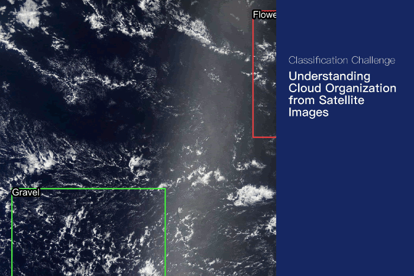

Climate change has been at the top of our minds and on the forefront of important political decision-making for many years. We hope you can use this competition’s dataset to help demystify an important climatic variable. Scientists, like those at Max Planck Institute for Meteorology, are leading the charge with new research on the world’s ever-changing atmosphere and they need your help to better understand the clouds.</br></br>

Shallow clouds play a huge role in determining the Earth's climate. They’re also difficult to understand and to represent in climate models. By classifying different types of cloud organization, researchers at Max Planck hope to improve our physical understanding of these clouds, which in turn will help us build better climate models.</br></br>

There are many ways in which clouds can organize, but the boundaries between different forms of organization are murky. This makes it challenging to build traditional rule-based algorithms to separate cloud features. The human eye, however, is really good at detecting features—such as clouds that resemble flowers.</br></br>

In this challenge, you will build a model to classify cloud organization patterns from satellite images. If successful, you’ll help scientists to better understand how clouds will shape our future climate. This research will guide the development of next-generation models which could reduce uncertainties in climate projections.</br></br>

Identify regions in satellite images that contain certain cloud formations, with label names: `Fish, Flower, Gravel, Sugar`. It is also required to segment the regions of each cloud formation label. Each image can have at least one cloud formation, and can possibly contain up to all all four.</br></br>

The images were downloaded from NASA Worldview. Three regions, spanning 21 degrees longitude and 14 degrees latitude, were chosen. The true-color images were taken from two polar-orbiting satellites, `TERRA` and `AQUA`, each of which pass a specific region once a day. Due to the small footprint of the imager (MODIS) on board these satellites, an image might be stitched together from two orbits. The remaining area, which has not been covered by two succeeding orbits, is marked black.</br></br>

The labels were created in a crowd-sourcing activity at the Max-Planck-Institite for Meteorology in Hamburg, Germany, and the Laboratoire de météorologie dynamique in Paris, France. A team of 68 scientists identified areas of cloud patterns in each image, and each images was labeled by approximately 3 different scientists. Ground truth was determined by the union of the areas marked by all labelers for that image, after removing any black band area from the areas.</br></br>

The segment for each cloud formation label for an image is encoded into a single row, even if there are several non-contiguous areas of the same formation in an image. If there is no area of a certain cloud type for an image, the corresponding EncodedPixels prediction should be left blank. You can read more about the encoding standard on the Evaluation page.</br></br>


## Setup
Libraries used for the project:
- Mask R-CNN (V 2.1.0) - https://github.com/matterport/Mask_RCNN
- Keras (V 2.2.5) - https://github.com/keras-team/keras/
- TensorFlow (V 1.1.5) - https://github.com/tensorflow/tensorflow
- COCO Weights - http://cocodataset.org/#home

Folder Structure setup for training the model:</br>
```
SCS-DL-3546-Final-Project
│   assets (Git README images store directory)
│   mask_rcnn_cloudimages.h5 (Trained Weights so you don't need to train)
│   mask_rcnn_coco.h5 (COCO Weights)
│   Mask_RCNN (mask r-cnn code directory)
│   presentation
│   │   Cloud_Image_Classfication_Presentation.ppsx (Presentation show file)
│   │   Cloud_Image_Classfication_Presentation.pptx (Powerpoint file)
│   Cloud_Image_Classification.ipynb (Jupyter notebook / source code)
│   test_images
│   │   <All images for model testing>
│   │   # Note this is optional as the test set is not used.
│   train_images
│   │   <All images for model training & validation>
│   train.csv (annotation file that contains the masks for train images)
│   README.md (Readme file)
```

## Exploratory Data Analysis (EDA) 


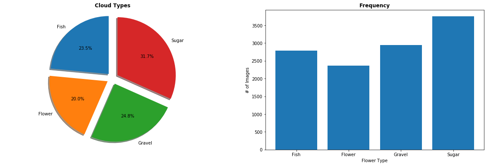

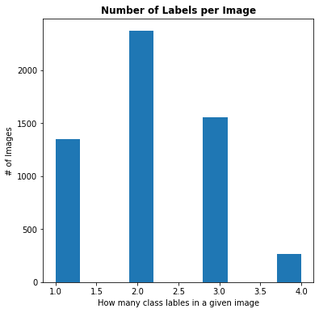

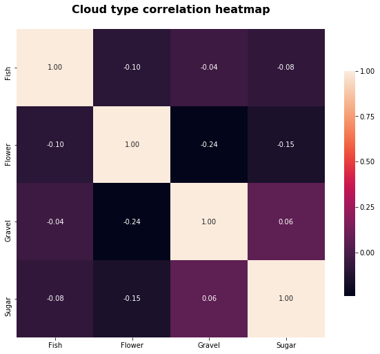

## Mask R-CNN Model
**Model:** Mask R-CNN (Detection & Segmentation)</br>
**Weight:** Coco</br>
**Image Dimension:** 1400 x 2100 (H x W)</br>
**Steps Per Epoch:** 2,218</br>
**Validation Steps:** 555</br>
**Confidence:** 70% (minimum)</br>
**Heads Layer Epoch:**  1 (few as possible)</br>
**All Layer Epoch:** 5 (Hardware limitations)</br>
**Training Time:**  ~16 hrs (Colab - GPU)</br>
**Evaluation Metric:** Mean Average Precision (mAP)</br>

Here is a glimpse of train images right before the training process. This is what the Mask R-CNN model sees when its training its network.</br>

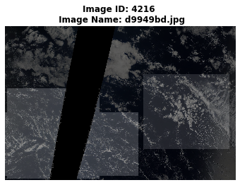


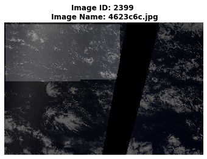


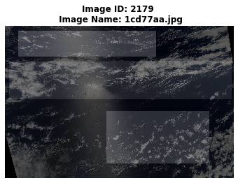


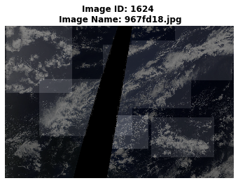

## Training & Validation Loss

*Training Loss*


*Validation Loss*

## Conclusion
Below are the images of the actual (from the original mask) vs predicted (Mask R-CNN masks with segmentatin)
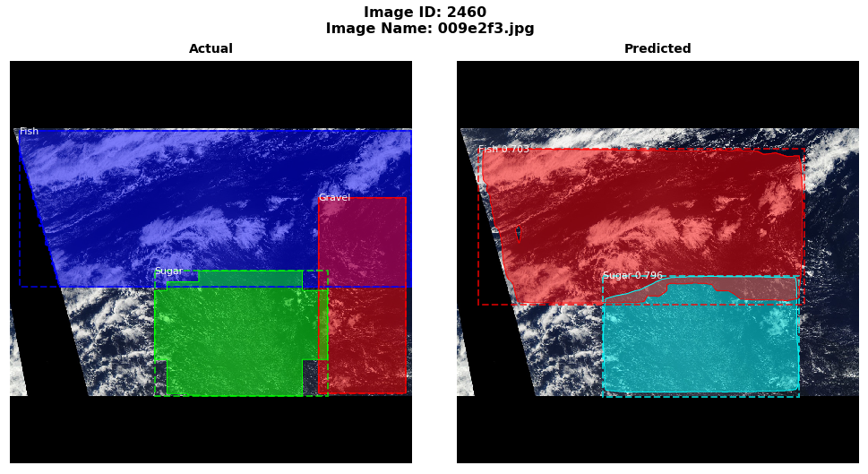

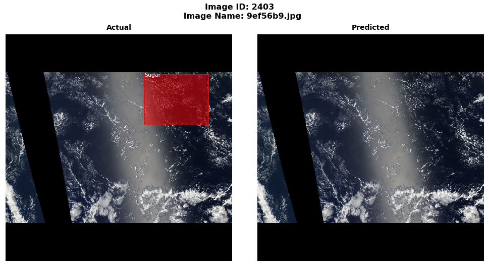
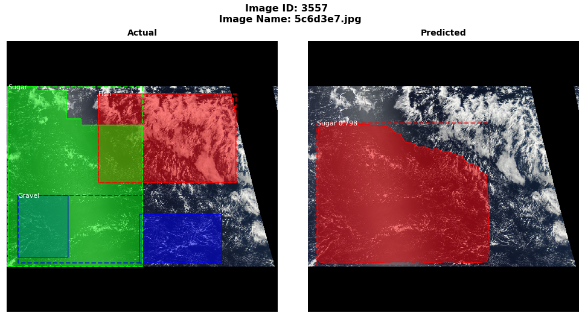
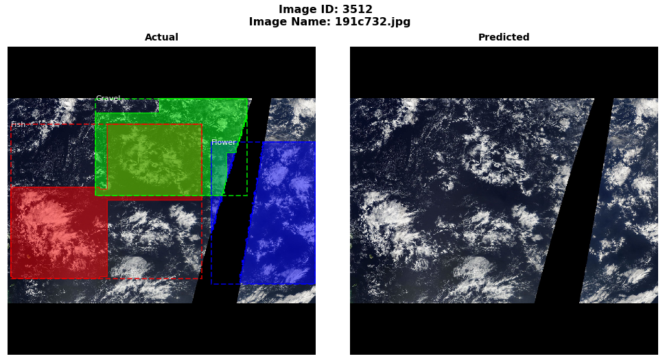


## Model Evaluation
We used the `Mean Average Precision (mAP)` score to evaluate our model. `mAP` is the recommended evaluation metric for object detection. For more details on the `mAP` score please check out https://towardsdatascience.com/breaking-down-mean-average-precision-map-ae462f623a52</br></br>
**`mAP` score on the train set:** 0.24895426446444854</br>

**`mAP` score on the validation set:** 0.23210710847789456</br>

## Next Steps
1. Train the model for more epochs (100).
2. Use Image Augmentation with pre & post processing.
3. Experiment with different weights (Imagenet).
4. Experiment with different DL Packages (Py-torch) / Models (Faster R-CNN, U-Net).
5. Annotate images with segmentation masks.

### Presentation
- [PowerPoint](https://github.com/nishp763/SCS-DL-3546-Final-Project/blob/master/presentation/Cloud_Image_Classfication_Presentation.pptx)
- [PDF](https://github.com/nishp763/SCS-DL-3546-Final-Project/blob/master/Cloud_Image_Classfication_Presentation_COPY.pdf)
- [YouTube Video](https://youtu.be/wAOazvwSG5k)
- [Google Drive - Colab](https://drive.google.com/drive/folders/1IUn_GJtEMzKHN1AO7vIKvxrKDWhNPM6x?usp=sharing)
